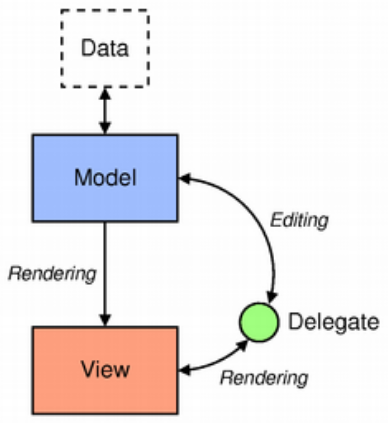

# Qt 的 Model-View 结构、从 Deepin 开源代码总结的写法

不定期内容持续更新


Model-View 设计模式是 MVC 的一个变种，其将 MVC 中的 V和C 组合在了一起，统称为 View。

> MVC （Model-View-Controller）是一种设计模式，其中：
>
> - Model ： 业务模型；
> - View ： 与用户交互的界面；
> - Controller ： 管理界面与用户的交互
>
> View 向用户展示 Model，用户通过 View 对程序发起交互（比如点击一个数据列表中的某一条数据并对其进行修改）；controller 收到用户发起的交互（如修改数据值）并调用【由 model 提供的、该交互对应的处理程序】，则 Model 就会对自身的数据进行实质上的修改；
> Model 完成数据修改后，需要给用户做出视觉上的反馈（即，在 View 中显示不同的东西）——这就需要对 View 进行合适的修改，这种修改就由 controller 来进行。

Qt 把 View 和 Controller 合并之后，又引入了一个新东西 `delegate`  ，开发者可以通过 delegate 对来自 model 的数据的渲染方式和编辑方式进行定制（实际上起到的作用基本还是 MVC 中的 C ）。MVD 三者都通过抽象类进行定义，提供了通用的接口和某些特性的实现。

Model 都继承自 `QAbstractItemModel`，其定义了 view 和 delegate 获取数据的方式

View 都继承自 `QAbstractItemView`，其定义了显示数据的方式（如 list、table、tree）

Delegate 都继承自 `QAbstractItemDelegate`，其负责向 view 中填充来自 model 的数据，并把用户通过 view 进行的数据修改传递给 model ，实现数据从界面到数据源的修改。



MVD 三者的交互通过信号和槽来实现

- model 发送的信号用于通知 view 数据源的改变；
- view 发送的信号用于通知用户的交互动作；
- delegate 通过发送信号将当前的修改状态发送给 model 和 view。


## 从 deb_installer 看出的一些写法

粗略从 deb_installer https://github.com/linuxdeepin/deepin-deb-installer 的代码中总结出的一些写法。供参考


- 各种 `widget` 、 `label` 、 `button` 、 `layout` 都是直接声明为指针的

  ```c++
      DebListModel *m_packagesModel;                      //model类
  
      DLabel *m_packageIcon;                              //包的图标
      DebInfoLabel *m_packageName;                        //包名
  
      InstallProcessInfoView *m_installProcessView;       //安装进度的详细信息
  
      InfoControlButton *m_infoControlButton;             //安装信息显示/隐藏控制按钮
  
      QVBoxLayout *m_centralLayout;                       //主布局
  
      QString m_description;                              //包的描述文本
  ```

- 页面和页面之间通过 `QPointer<QWidget>` 进行连接

  ```c++
      QPointer<QWidget> m_lastPage;                   //存放上一个页面的指针
      QPointer<QWidget> m_UninstallPage;              //Store uninstall page
  ```

- 界面是 page，page 由 widgets 组成。page 的构造函数只做赋值，并调用自己的 initUI() 来构造 UI （widgets 比较简单，可以自己直接在构造器里面构造自己的 UI 等），如：

  ```c++
  DebInstaller::DebInstaller(QWidget *parent)
      : DMainWindow(parent)
      , m_fileListModel(new DebListModel(this))
      , m_fileChooseWidget(new FileChooseWidget)
      , m_centralLayout(new QStackedLayout())
      , m_dragflag(-1)
  {
      initUI();
      initConnections();
  }
  ```

- 一个类的 connect 要放在一个单独的函数中集中做（看上面的代码）

- 页面切换时，新页面的创建由主窗口对象进行。（页面其实是一个 widget ，该 widget 被设置为 MainWindow 的 central widget）。老页面被换掉之后，使用 `deleteLater()` 进行释放（即使该 widget 在实例化时需要传入 this 作为 parent ，也还是需要在必要的时候 deleteLater ）。

- 按钮在构造的时候需要传入 this 以设置为父对象，析构父对象的时候可以一起带走按钮